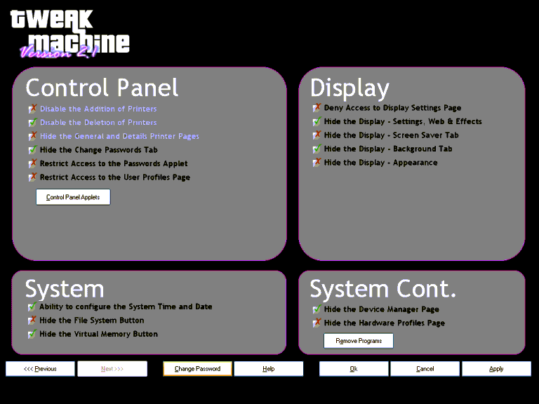



## Tweak Machine \(compatable with all Windows versions\)

### Description

Tweak Machine (compatable with all Windows versions) - This application consists of highly graphical detail of configuring or changing the system registry for security purposes. It would come to use for networking or home computers. Have you seen that these programs cost lots of money, well this program is free to use. To stop unauthorised users trying to change the registry this program is password protected with a extreme encoding process and have the capability of changing the password. If you are not familiar with the registry do not try and change it your self because it could crash the system. This uses high-tech xp style buttons. This also has four user-controls textbox, checkbox, frame and xp button. The checkbox is a fully animated button, when you click it, it changes the image. It is composed of two screens which are accessable by pressing one of the buttons on the bottom-left of the screen as shown in the screenshot. You are able to; hide the Control Panel Applets, Remove Programs, hide drives and many more. One that is highly used thoughout networks is Dont Display Last User logged onto the network. I would like to thank Noushad P for permission to develop his program which was based on Windows 98. I also would like to address that I do not take any responsibility for any system crashes or failures. This program is not to be sold.
 
### More Info
 

             |
---                |---
**Submitted On**   |2004-11-14 09:08:14
**By**             |[Craig Phillips](https://github.com/Planet-Source-Code/PSCIndex/blob/master/ByAuthor/craig-phillips.md)
**Level**          |Intermediate
**User Rating**    |3.3 (13 globes from 4 users)
**Compatibility**  |VB 3\.0, VB 4\.0 \(16\-bit\), VB 4\.0 \(32\-bit\), VB 5\.0, VB 6\.0
**Category**       |[Complete Applications](https://github.com/Planet-Source-Code/PSCIndex/blob/master/ByCategory/complete-applications__1-27.md)
**World**          |[Visual Basic](https://github.com/Planet-Source-Code/PSCIndex/blob/master/ByWorld/visual-basic.md)
**Archive File**   |[Tweak\_Mach18180511142004\.zip](https://github.com/Planet-Source-Code/craig-phillips-tweak-machine-compatable-with-all-windows-versions__1-57244/archive/master.zip)

